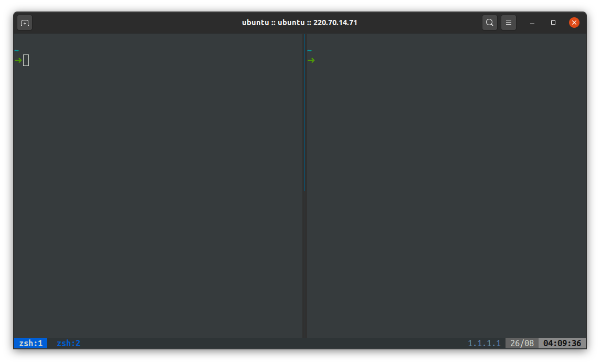

<p align="center">
  
</p>

<h1 align="center">👹 ttuk-ttak.sh</h1>

<p align="center">
  <b>a set of Automation script for my Dev environment</b>
</p>

<br/>

## Installation  

<b>Just type
```bash
$ ./run.sh
```

<br/>

## Inspired by
* https://github.com/denysdovhan/spaceship-prompt
* https://github.com/zaiste/tmuxified
